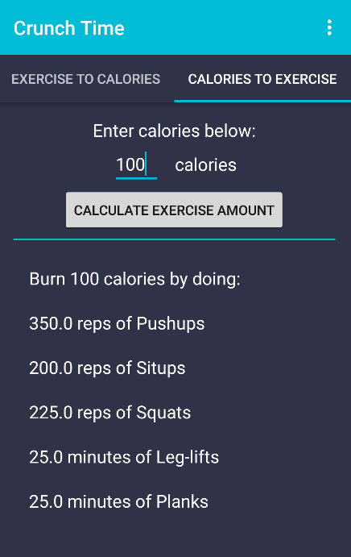

# PROG 01: Crunch Time
This app allows you to input the quantity (in reps or minutes) of a particular exercise and find out how many calories you've burned. You can also find out the quantities of other exercises you can perform to burn the same amount of calories. Alternatively, if you're undecided about which exercise to perform you can input how many calories you want to burn, and find out the amounts of different exercises you can do to achieve that goal. 

## Authors

Parul Singh ([parulsingh@berkeley.edu](mailto:your_email@berkeley.edu))

## Demo Video

See [Crunch Time Demo] (https://youtu.be/zipLS8hfJZE)

## Screenshots

## Acknowledgments
I used this tutorial to create the tab layout:
http://www.truiton.com/2015/06/android-tabs-example-fragments-viewpager/

*Feel free to enhance your README. For Markdown syntax, see [the GitHub Guides](https://guides.github.com/features/mastering-markdown/). Remove this line in your submission.*
